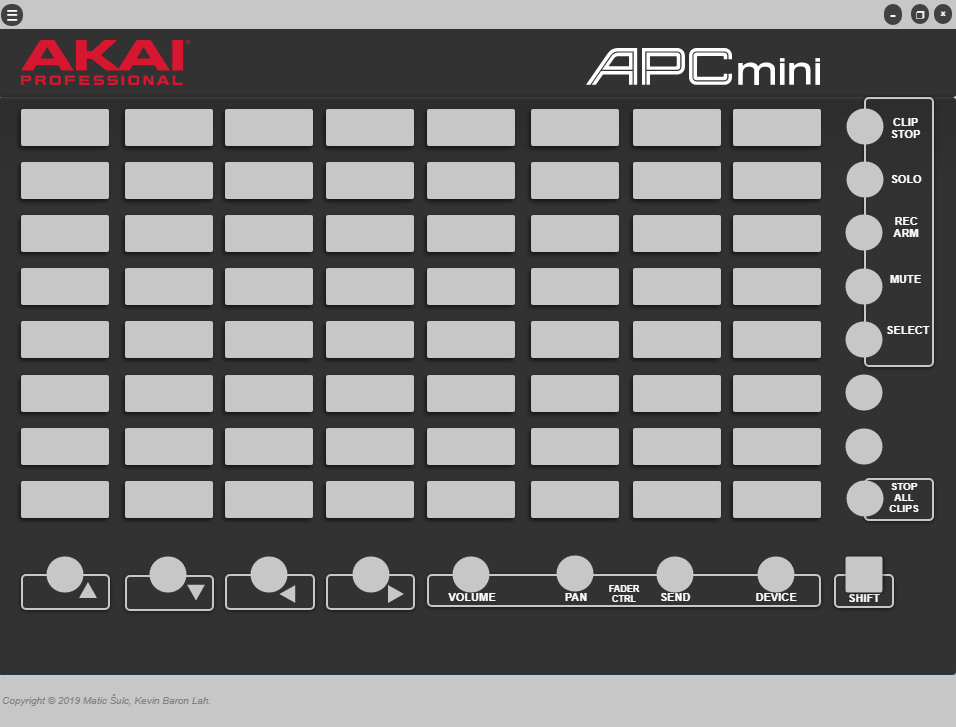

  

  <h3 align="center">AKAI APC mini LED Control</h3>

  

    The software allows you to control lights on your apc mini control.
     
    <a href="https://github.com/maxtheashepherd/ledcontrol/issues">Report Bug</a>
    ·
    <a href="https://github.com/maxtheashepherd/ledcontrol/issues">Request Feature</a>
  

<!-- ABOUT THE PROJECT -->
## About The Project

 

  

### Built With

* [HTML]()
* [CSS]()
* [NodeJS](https://nodejs.org/en/)
* [NWJS](https://nwjs.io/)

<!-- GETTING STARTED -->
## Getting Started

### Prerequisites
* Node.js (14.0+)

### Installation and usage
Latest builds are already compiled and available in build/AKAI APC Mini LED Controller.
For building your own version, compile using latest NWJS and package for your desired os. 
For more information regarding building this package, please visit https://nwjs.readthedocs.io/en/latest/.

<!-- CONTRIBUTING -->
## Contributing

Contributions are what make the open source community such an amazing place to be learn, inspire, and create. Any contributions you make are **greatly appreciated**.

1. Fork the Project
2. Create your Feature Branch (`git checkout -b feature/AmazingFeature`)
3. Commit your Changes (`git commit -m 'Add some AmazingFeature'`)
4. Push to the Branch (`git push origin feature/AmazingFeature`)
5. Open a Pull Request

<!-- LICENSE -->
## License

Distributed under the MIT License. See `LICENSE` for more information.

<!-- CONTACT -->
## Contact

Max Shepherd - [@Max__Shepherd](https://twitter.com/Max__Shepherd) - maxtheashepherd@gmail.com 
 
Matic Šulc - [@MaticSulc](https://github.com/MaticSulc)

Project Link: [https://github.com/maxtheashepherd/ledcontrol](https://github.com/maxtheashepherd/ledcontrol)

